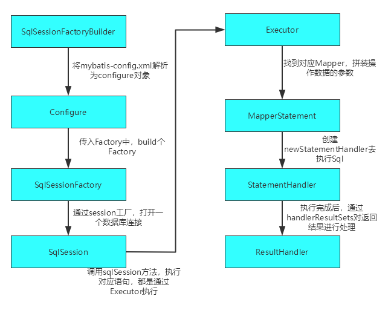

# MyBatis

### 一 MyBatis是什么？

1. MyBatis是一个半自动ORM(Object-Relationl Mapping，对象关系映射)框架，能够将数据库与程序中对象进行相互映射。MyBatis通过配置xml文件或者注解方式，进行配置和映射对象信息，使得能够像操作对象一样，从数据库中获取更新数据。
2. MyBatis内部封装了JDBC，开发过程只需重点关注SQL语句，不需要去处理驱动加载，创建连接

### 二 myBatis-config.xml可配置参数

| 名称                                 | 作用                                                         |
| ------------------------------------ | ------------------------------------------------------------ |
| 属性（properties）                   | 系统属性通过配置文件配置                                     |
| 设置（settings）                     | 改变MyBatis 的运行时行为                                     |
| 类型别名（typeAliases）              | 为type配置别名，使显示更加简洁                               |
| 类型处理器（typeHandlers）           | 将从预处理语句或者结果集中参数，以合适的方式转换成 Java 类型 |
| 对象工厂（objectFactory）            | 提供默认构造器或者执行构造参数初始化目标类型对象             |
| 插件（plugins）                      | 在映射语句执行过程中的某一点进行拦截调用                     |
| 环境配置（environments）             | 配置多种数据库环境                                           |
| 数据库厂商标识（databaseIdProvider） | 根据不同的数据库厂商执行不同的语句                           |
| 映射器（mappers）                    | 定义 SQL 映射文件                                            |

### 三 MyBatis主要结构

| 名称              | 描述                                                         |
| ----------------- | ------------------------------------------------------------ |
| Configuration     | 对应mysql-config.xml的全局配置关系类                         |
| SqlSessionFactory | 管理session的工厂接口                                        |
| Session           | SqlSession与数据库建立连接的接口。包含了操作数据库的方法     |
| Executor          | 执行器接口，负责Sql语句的生成和查询缓存维护                  |
| MappedStatement   | 底层封装对象，对操作数据库的语句存储封装，对应映射文件里select\|update\|delete\|insert标签里对应内容 |
| StatementHandler  | 封装了JDBC Statement操作，负责对JDBC statement 的操作，如设置参数等 |
| ResultSetHandler  | 处理操作数据库后返回的结果集handler接口                      |


### 三 MyBatis代码中主要处理流程？

1. 读取配置文件mysql-config.xml，对配置文件内容，进行解析，存入对应类为Configureation中
2. 将解析后mysql-config.xml中的配置信息，作为参数传入DefaultSqlSessionFactory中，构造管理session的工厂SqlSessionFactory
3. 通过SqlSessionFactory中创建一个与数据库的连接sqlSession，包含事务、一级缓存、拦截器，都在此时进行初始化
4. SqlSession接口主要定义了操作数据库（查询、删除、更新等）方法，调用这些方法执行相应sql语句
5. 调用SqlSession中方法后，最终都是通过执行器executor执行
6. 执行前，通过MapperStatement对执行Sql语句，参数进行封装
7. 封装完成，通过newStatementHandler去执行sql
8. 通过handlerResultSets对返回结果进行处理



### 四 MyBatis如何将XML映射文件转化为MyBatis中内部文件？

对于mybatis-config.xml配置文件

读取mybatis-config.xml文件后，会进行XML文件解析转为对应Document 对象，进而进行MyBatis配置参数的解析，全部转化放入Configureation对象中。然后将Configureation传入，构建SqlSession工厂DefaultSqlSessionFactory。

对于Mapper.xml映射文件

- 对于查询结果resultMap、变量parameterMap，都会被解析为对应对象

- 对于<select> <insert> <update>  <delete> 标签，会被转化为MappedStatement 对象，标签内Sql转化为Boundle对象。因此在执行Sql时，会去找对应MappedStatement 

```java
  public void parse() {
    if (!configuration.isResourceLoaded(resource)) {
      configurationElement(parser.evalNode("/mapper"));
      configuration.addLoadedResource(resource);
      bindMapperForNamespace();
    }

    parsePendingResultMaps();
    parsePendingCacheRefs();
    // 解析<select> <insert> <update>  <delete>表签
    parsePendingStatements();
  }
```

### 五 MyBatis中执行器分类？

三种基本的执行器，BatchExecutor、ReuseExecutor、SimpleExecutor

**SimpleExecutor**

默认执行器，每次执行一次update或者select就会开启一个Statement，执行完成后就会关闭Statement

**BatchExecutor**

批量执行器，执行update

**ReuseExecutor**

不同于SimpleExecutor执行器，每执行完一次就关闭Statement，而是能够重复使用statement


### MyBatis中$和#号区别？

$和#都是参数标记，在动态解析时有差别

1. 使用#{}，在执行到预编译时，会将#{}替换为？占位符，执行时替换为实际值，然后加上单引号，从而防止sql注入。

   ```java
   PreparedStatement ps = conn.prepareStatement(sql);
   ps.setInt(1,id);
   // 初始Mapper中定义SQL为  Select * from tb_user where name = #{userName}
   // 执行前boundSql中变为：Select * from tb_user where name = ？
   ```

2. 使用${}，会将传入的数据直接显示生成在sql中，只是做简单的字符串替换，不会添加单引号

   ```java
   Statement st = conn.createStatement();
   ResultSet rs = st.executeQuery(sql);
   // sql为 Select * from user where name = ${userName}
   // 传入参数为
   // 解析后执行的SQL：Select * from user where name = xiaoming
   ```

**区别**

- $方式无法防止Sql注入， #方式能够很大程度防止sql注入
- $方式一般用于传入数据库对象，如表名
- 通常多用#{}


## 参考

- JavaGuide中MyBatis章节


